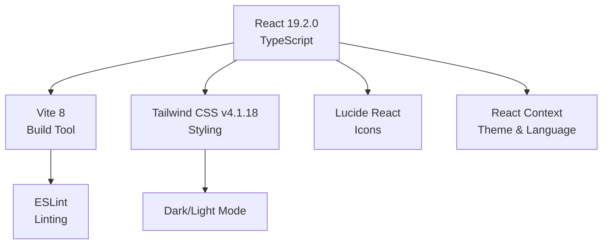
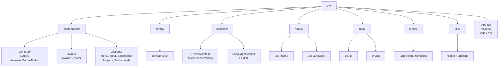
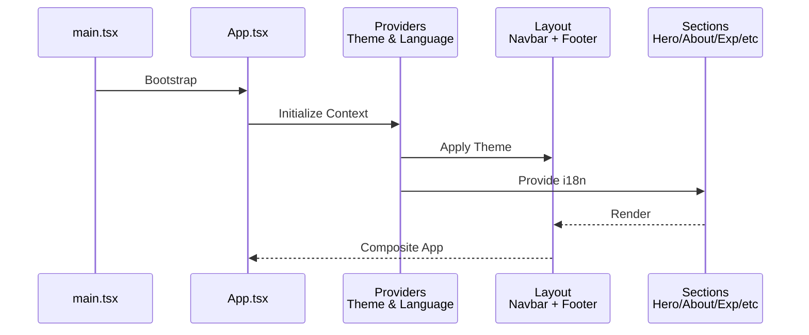
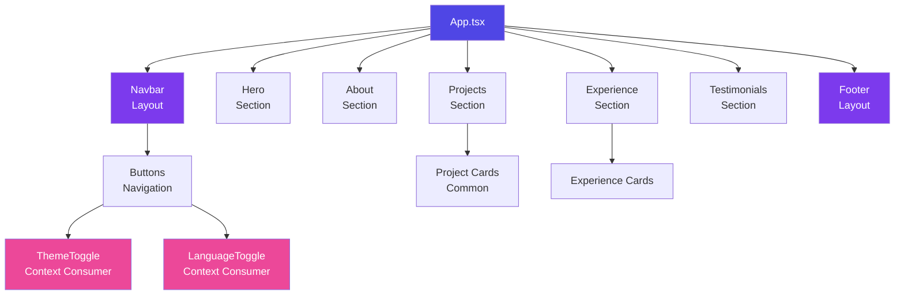
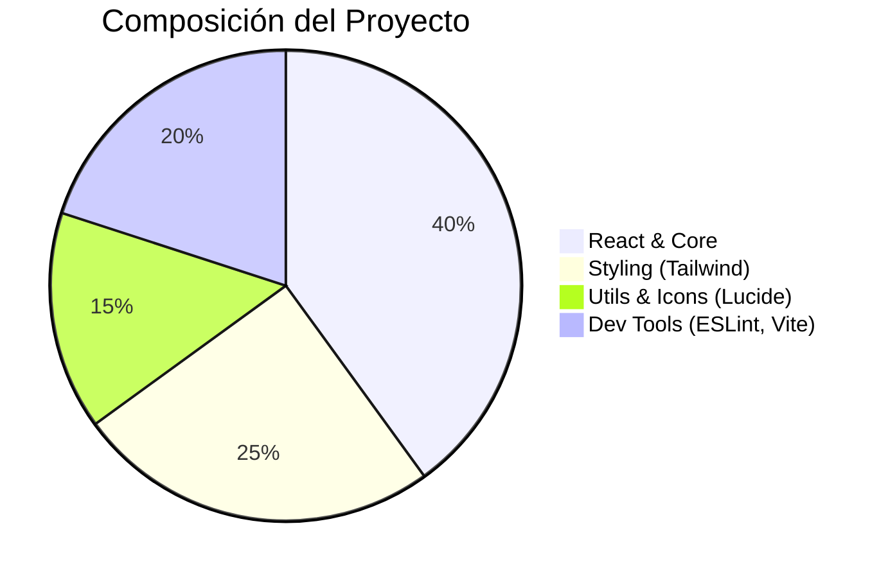

# Personal Portfolio — Valentina Burbano

Portfolio personal construido con **React 19 + TypeScript + Tailwind CSS v4 + Vite**.

## Tech Stack



## Instalación y Desarrollo

```bash
# Instalar dependencias
npm install

# Servidor de desarrollo
npm run dev

# Build producción
npm run build

# Preview de producción
npm run preview

# Lint
npm run lint
```

## Estructura del Proyecto



## Flujo de la Aplicación



## Arquitectura de Componentes



## Características Principales

| Característica | Estado | Descripción |
|---|---|---|
| Modo Oscuro/Claro | Habilitado | Tema alternante con Context API |
| Internacionalización | Habilitada | ES/EN soportados |
| Responsive Design | Habilitado | Tailwind CSS + Mobile-first |
| Type-Safe | Habilitado | TypeScript en 100% del código |
| Rendimiento | Optimizado | Vite + Optimizaciones |
| Accesibilidad | Habilitada | Semántica HTML correcta |

## Dependencias Clave



## Despliegue

El proyecto está optimizado para despliegue en plataformas modernas:
- Vercel (Recomendado)
- Netlify
- GitHub Pages
- AWS Amplify

---

**Desarrollado por Valentina Burbano** | 2026
